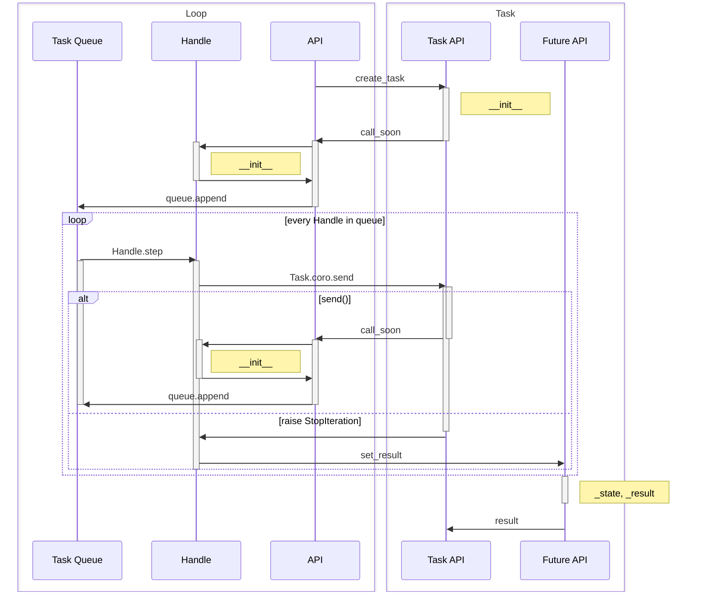

# 🎶 Syncopate
Syncopate is an experimental ASGI framework that thrives on the polyrhythmic magic of async Python. This project is built as a learning exercise, so it re-implements all the wheels posible: the `asyncio` event loop and server, [uvicorn](https://www.uvicorn.org/) HTTP ASGI server, and [starlette](https://www.starlette.io/) ASGI toolkit. __It is not meant for production!__ Use under your own risk.

### 📖 Table of Contents
- ⚒ [Env Setup and Development](#-env-setup-and-development)
- ⚙ [Running Syncopate](#-running-syncopate)
- [Event loop diagram](#loop-diagram)

## ⚒ Env Setup and Development
To set up your local environment for development run
```shell
make envsetup
```
This will create a virtual environment for the project and install the pre-commit hooks. Syncopate doesn't have any third-party requirements, it does everything itself!

## ⚙ Running Syncopate
Build an ASGI app:
```python
from syncopate.framework import Syncopate

app = Syncopate()


@app.route("/")
async def index(request):
    return "Hello, World!"


@app.route("/api")
def api(request):
    return {"hello": "world"}
```
and run it:
```python
import syncopate

syncopate.run(app, host="localhost", port=8888)
```
This will start the syncopate server and run the app on [http://localhost:8888](http://localhost:8888).

## Loop Diagram

